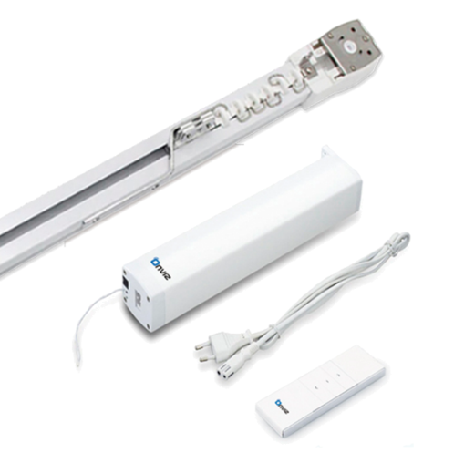
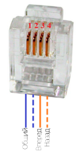
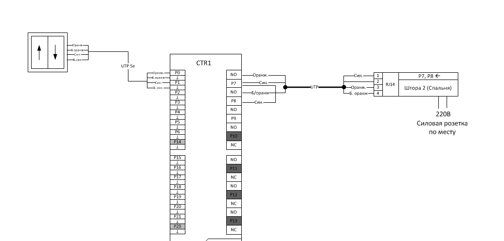
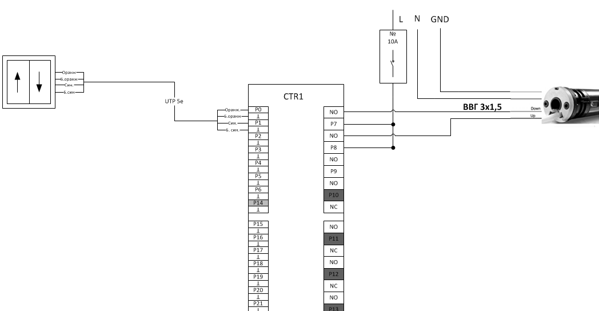

# Подключение

## Электрокарниз OnViz

Для подключения раздвижного электрокарниза можно использовать любые два выхода
контроллера TouchOn. Р7-Р13, Р22-Р28

Подключение к контролеру производится по следующей схеме:

**К каждой шторе подвести витую пару UTP  5cat. Питание берем с групп розеток.**

## Устройства с фазным управлением. Рулонные электрокарнизы OnViz. Рольставни. 

В случае фазного управления необходимо использовать прямой питающий кабель от
контроллера к устройству. Поэтому необходимо тянуть питающий кабель к каждой
шторе отдельно. Подключаются к любому выходу контроллера по следующей схеме: 

