# Подключение

## Сервоприводы

Для управления водяным теплым полом и водяными радиаторами используются
нормально-открытые сервоприводы (NO) 220В. Можно использовать любые
сервоприводы, в зависимости от конкретной системы отопления.  Для управления
подачи теплоносителя теплого пола сервоприводы устанавливаются на коллектор
теплого пола. Сервоприводы можно объединять в группы.

Для управления радиаторами, сервоприводы устанавливаются, либо на коллектор,
либо непосредственно на радиатор, в зависимости от конкретной системы отопления
Сервоприводы  подключаются к любому выходу контроллера на NO контакт.

### Рекомендуемые модели сервоприводов

* **STOUT STE-0010**  Электротермический компактный сервопривод, нормально открытый.

* **Gappo G461 220B**  Сервопривод нормально открытый.

* **Gappo G463 220B**  Сервопривод нормально открытый.

* Или аналогичные.

### Схема подключения сервоприводов

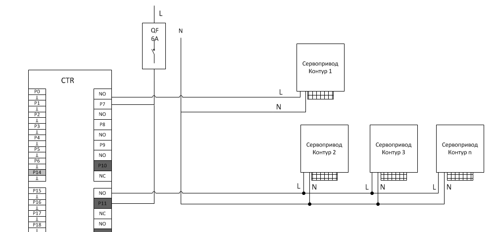

## Котёл

Для подключения котла к контроллеру  используем контакты подключения комнатного
регулятора температуры на клеммной колодке котла и любой NC выход контроллера.
При размыкании цепи контроллером котел будет выключать режим отопления,
оставаясь в   режиме подогрева воды. По такому принципу подключаются большинство
электрических и газовых котлов.

Пример подключения электрического котла Vaillant 18/14.

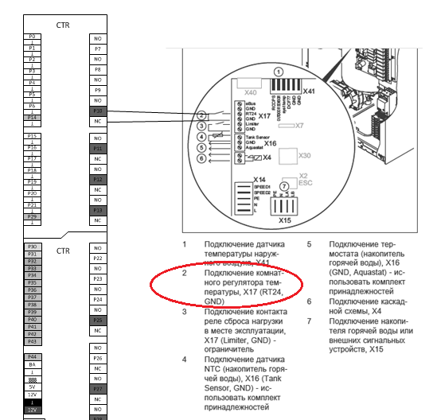

## Датчик температуры воздуха

Датчик температуры построен на базе DS18B20 и использует интерфейс 1wire.
Подключается к любому цифровому входу. Р14,Р29,Р30-Р44. 

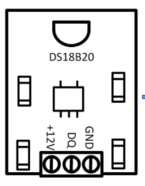

### Характеристики датчика:

|                                 |                                      |
| ------------------------------- | ------------------------------------ |
|  Электропитание                 |  12в                                 |
|  Диапазон измеряемых температур |  От -55 до +125                      |
|  Протокол                       |  1-Wire                              |
|  Способ монтажа                 |  Скрытый, в подрозетник или в корпус |

### Схема подключения:

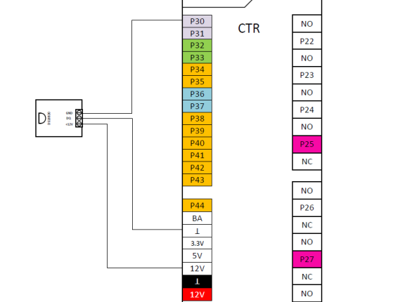

## Датчик температуры тёплого пола

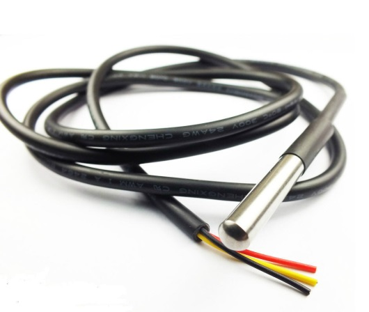

Датчик температуры построен на базе DS18B20 и использует интерфейс 1wire.
Подключается к любому цифровому входу. Р14,Р29,Р30-Р44 через плату сопряжения.  

### Характеристики датчика:

|                                 |                                      |
| ------------------------------- | ------------------------------------ |
|  Электропитание                 |  12в                                 |
|  Диапазон измеряемых температур |  От -55 до +125                      |
|  Протокол                       |  1-Wire                              |
|  Способ монтажа                 |  Скрытый, в стяжку пола              |

### Схема подключения:

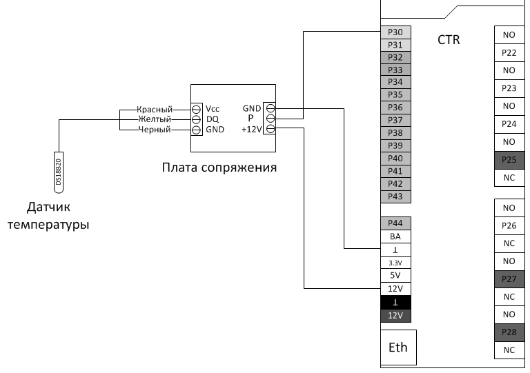

### Монтаж датчика

Для датчика температуры теплого пола закладывается гладкостенная труба до
заливки стяжки пола. Труба должна выходить над витками теплого пола, но
находится в стяжке.  Закладную трубу можно поднять до выключателя или коробки
Датчика температуры воздуха и произвести там коммутацию.

Способ монтажа датчика в стяжку пола:

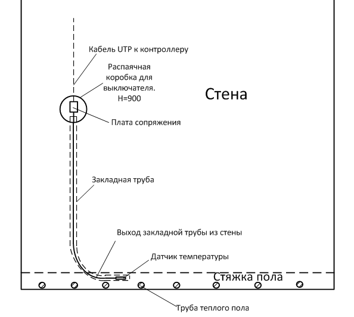

* **При монтаже закладной трубы избегать прямых углов изгиба. Для
  беспрепятственного монтажа датчика температуры**

* **Конец закладной трубы должен находиться над трубами теплого пола 20см от
  стены**

## Датчик температуры и влажности

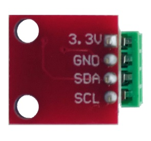
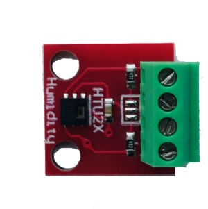

Комбинированный датчик температуры и влажности устанавливается в основном в
санузлах и в помещения, где необходимо принудительно включать вентиляцию. 

HTU21D - крохотный цифровой датчик для шины I2C. Размеры его платы всего 15 х 15
мм. HTU21D может выдавать значение, как влажности, так и температуры.
Подключение датчика производится на два любых цифровых порта контроллера.
Р30-Р43, Р14,Р29  Питание 3.3В тоже берем с соответствующего выхода контроллера. 

Рекомендуем устанавливать датчик на высоте 1,6-1,7 м. Кабель подключения UTP5e.

### Схема подключения

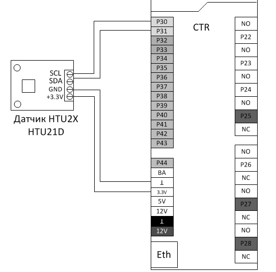

## Уличный датчик температуры и освещённости

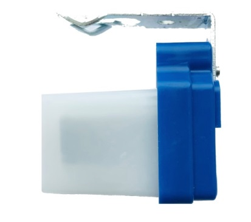
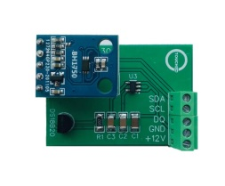

Комбинированный уличный датчик температуры и освещенности монтируется на
несолнечной стороне дома. Подключение датчика производится на три любых цифровых
порта контроллера. Р30-Р43, Р14,Р29  Питание 12В тоже берем с соответствующего
выхода контроллера.  Кабель подключения UTP5e. 

### Схема подключения

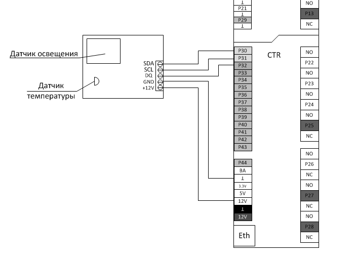
