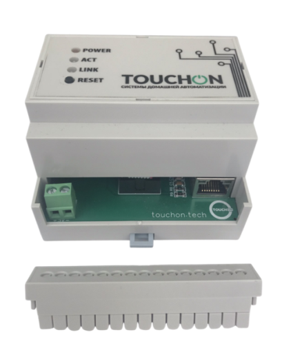
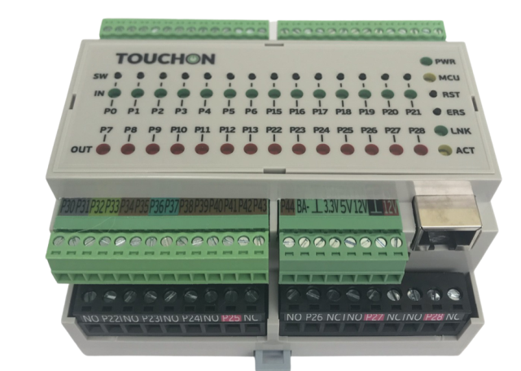
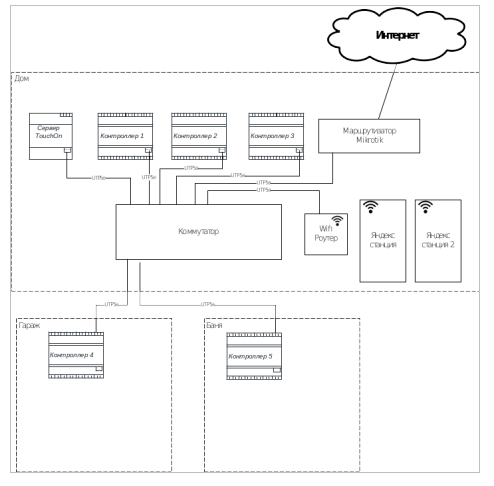

# Добро пожаловать в документацию системы домашней автоматизации TouchOn

## Описание

Система домашней автоматизации TouchOn строится на базе сервера и
микроконтроллера.Связь модулей системы происходит по сети Ethernet и для их
объединения необходим коммутатор или роутер, который подбирается исходя из
количества контроллеров.

Кроме того, для управления и мониторинга системы необходим маршрутизатор Mikrotik. 

## Состав системы

### Сервер

Сервер устанавливается на DIN рейку и имеет один Ethernet порт и клеммы для
подключения питания. Питание контроллера  DC +5В. Конфигурация системы
происходит через админпанель, которая доступна через Web-интерфейс сервера. 

    IP-адрес сервера, по умолчанию: 192.168.6.50. 

    Имя пользователя:  admin; пароль: 111111

### Контроллер

Котроллер TouchOn имеет 14 аналоговых входов, 14 аналоговых выходов с
возможностью подключения нагрузки до 16А. И  17 цифровых входов для подключения
датчиков и дополнительных модулей (модуль диммера, модуль управления котла и др.)
Питание контроллера DC 12В либо POE.

    адрес контроллеров по умолчанию 192.168.0.14/sec 

    ip: 192.168.0.14; пароль: sec

### Общий вид системы

## Области применения

### [Освещение](light_system/light_overview.md)
### [Отопление](heat_system/heat_overview.md)
