# Подключение

## Основное подключение

Структурная схема подключения
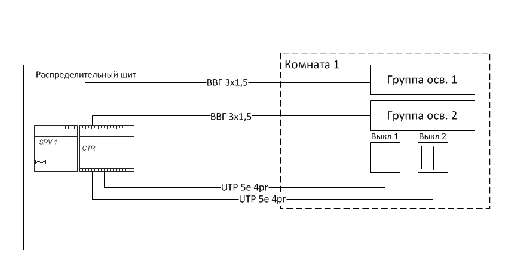

Пример подключения групп освещения
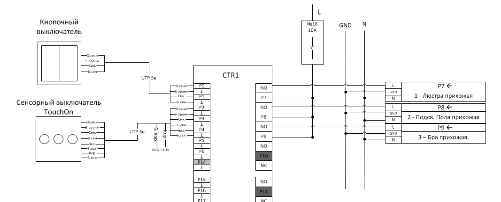

## Подключение диммируемых групп освещения

Диммируемая группа освещения подключается через блока питания с управлением
 по 0-10V со стороны нагрузки и блоком диммируемых групп со стороны ЩР.  
Блок питания устанавливается возле светильника и рассчитывается по мощности 
в зависимости от мощности используемых осветительных проборов и длинны диодной 
ленты.  От блока питания до ЩР используется кабель ВВГ3х1.5 и витая пара UTP 5e 
для управления. 

Структурная схема подключения
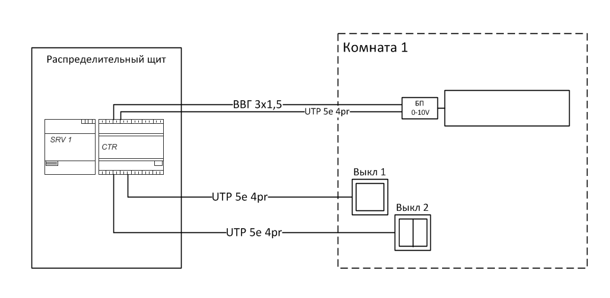

Принципиальная схема подключения
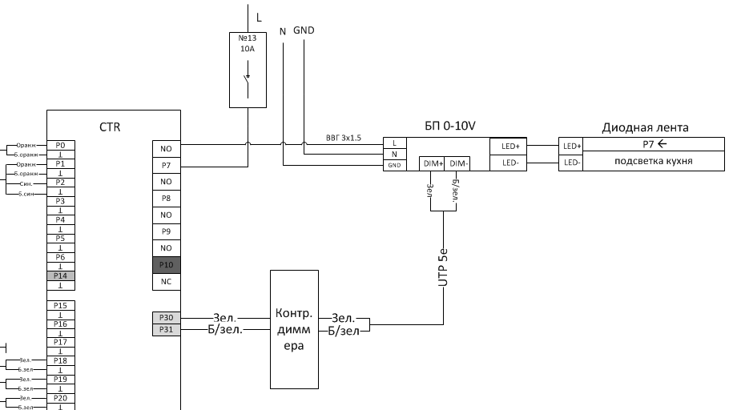

## Подключение выключателей

В качестве выключателя используются кнопки возвратного типа без фиксации. Это
нужно для того, чтобы можно было реализовать функции двойного и длительного
нажатий.  Для подключения выключателей используется 4 парный кабель  UTP5e. 
К одной витой паре можно подключить 4 кнопки обычного выключателя  или 3 кнопки
сенсорного. 

Кнопочные выключатели подключаются на любой стандартный вход P0-P6 и P15-P21.
Соответственно к одному контроллеру можно подключить 14 клавиш выключателей.  
Сенсорные выключатели подключаются на цифровые порты P30-P44, P14 и З29

Схема подключения выключателей: 

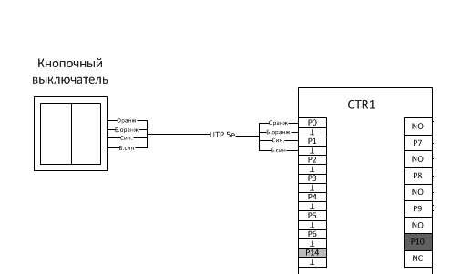

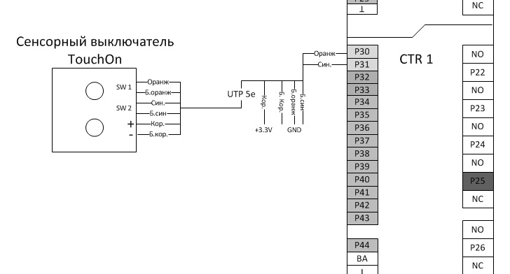

## Примеры выключателей

* Сенсорные выключатели:

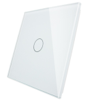
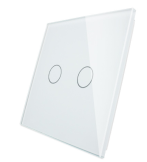
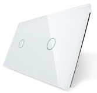

* Кнопочные выключатели Schneider Unica и др.:

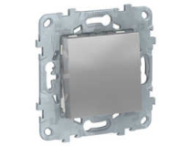
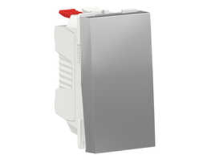

* Кнопочные выключатели legrand серии Valena in Matic и др.:

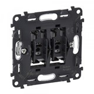
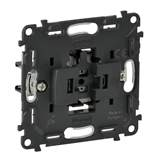
