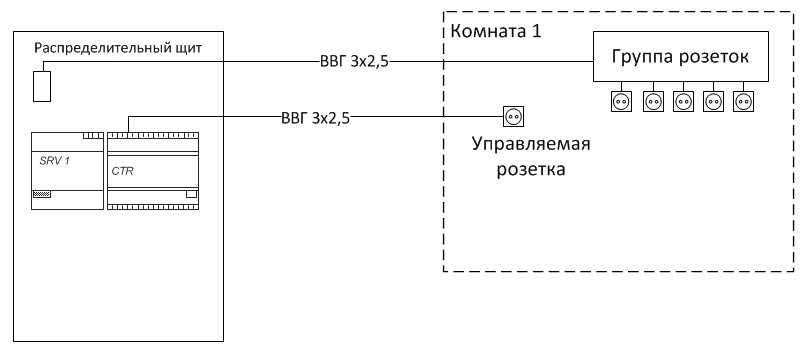
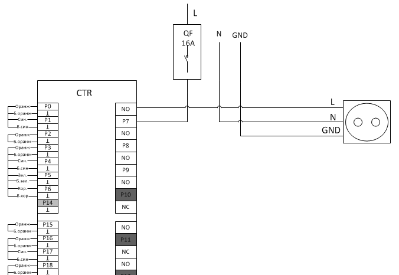
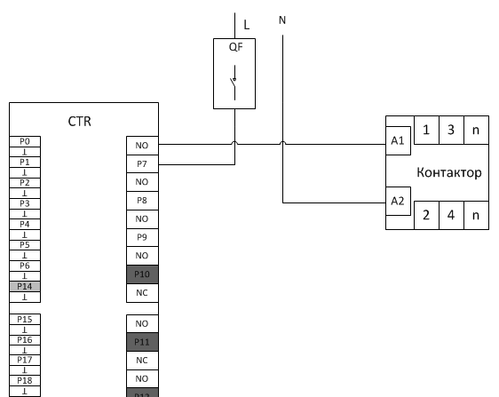

# Подключение нагрузок

## Подключение стандартных розеток

Схема подключения групп розеток и отдельных управляемых розеток:

## Подключение силовых групп

Для управления силовыми группами или большими нагрузками (более 16А) необходимо
использовать контакторы. 

Схема подключения силовых групп через контактор:

