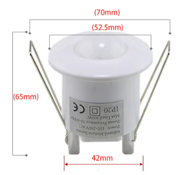
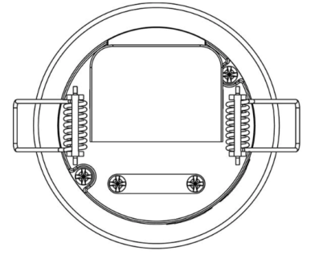
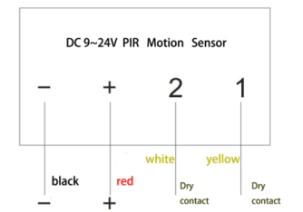
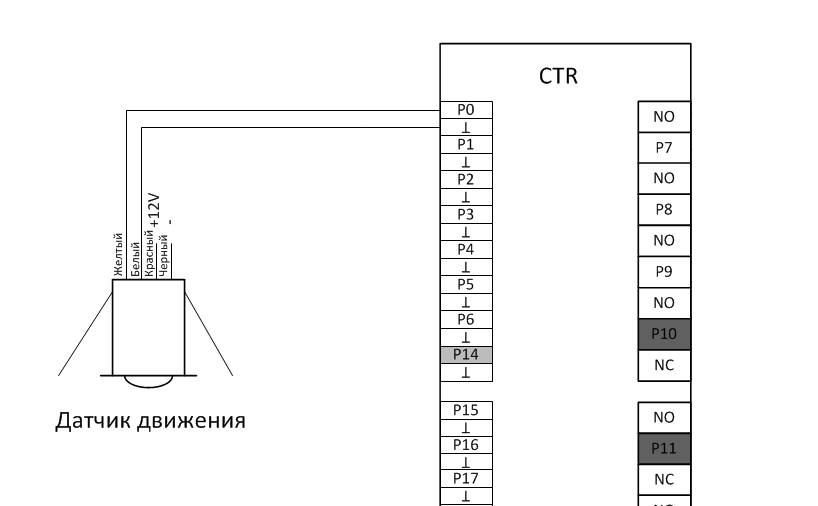
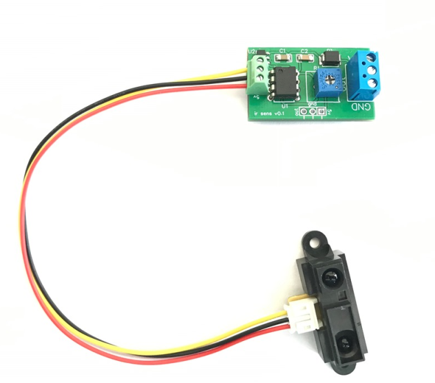
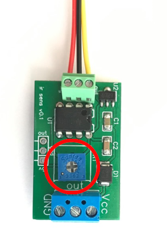
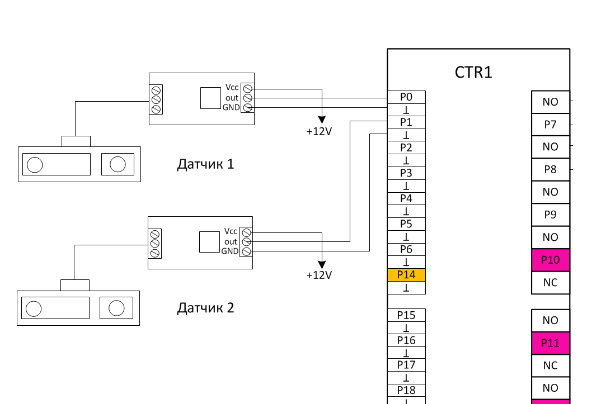
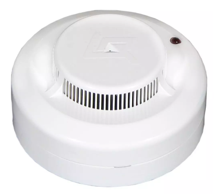
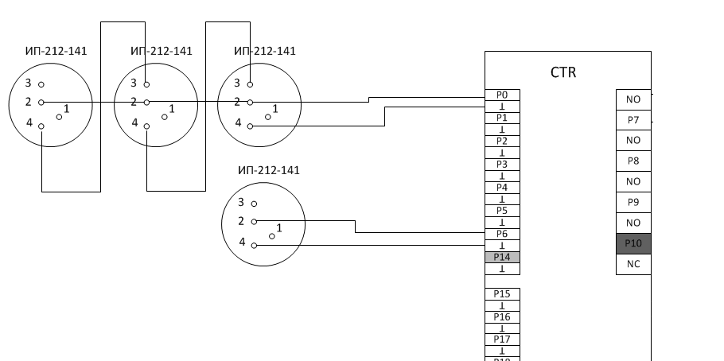

# Подключение

## Датчик движения

Датчик движения потолочного исполнения. Питание 12V. Сигнал срабатывания –
сухой контакт. Питание можно использовать как с контроллера, так и с любого
другого блока питания 9-24В. Датчик движения подключается в любой аналоговый
вход P0-P6, P15-P21. 

Схема подключения к контроллеру:

## Датчик расстояния. Управление  подсветкой лестницы

Для включения/выключения подсветки лестницы или для запуска сценария подсветки
лестницы используются датчики расстояния. Датчики устанавливаются на заглушку,
и прячутся в монтажную коробку в начале лестницы и в конце. К каждому датчику
от контроллера нужно протянуть кабель UTP. Датчик подключается через модуль
сопряжения, а на контроллер заводится на любой аналоговый вход контроллера. На
модуле находится подстроечный резистор для калибровки расстояния срабатывания.  

### Характеристики датчика

|                            |                                 | 
| -------------------------- | ------------------------------- |
|  Электропитание            |  12V                            |
|  Расстояние срабатывания   |  10-80см.                       |
|  Протокол                  |  NO                             |
|  Способ монтажа            |  Скрытый, в монтажную коробку.  |

### Регулировка расстояния срабатывания

### Схема подключения

## Датчик дыма

Для подключения датчика к контроллеру требуется всего 2 провода. Датчик можно
подключить к любому аналоговому порту контроллера Р0-Р6, Р15-Р21. Никаких
дополнительных резисторов, диодов или чего бы то ни было еще - не нужно.
Никакого дополнительного питания не нужно!  К одному входу можно подключить до
4-х пожарных датчиков шиной. В этом случае первый сработавший датчик включает
вход исполнительного модуля, а второй датчик (если дым до него еще не дошел)
продолжит моргать в дежурном режиме. Если важно определить какой именно датчик
сработал, то следует подключать каждый датчик к отдельному порту. Если же нужно
определять только сам факт задымления, то можно подключать несколько датчиков к
одному порту (до 4-х). 

Схема подключения датчика:

