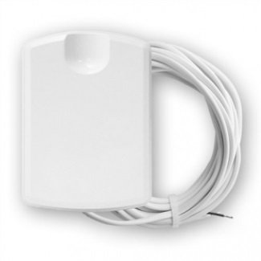
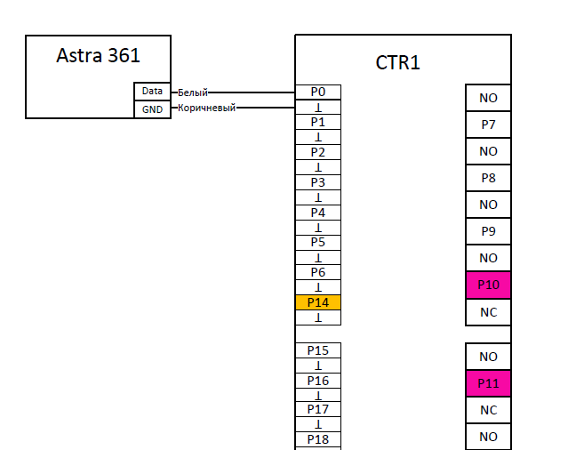
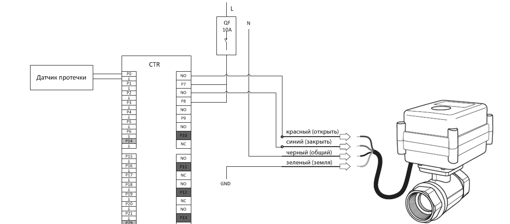
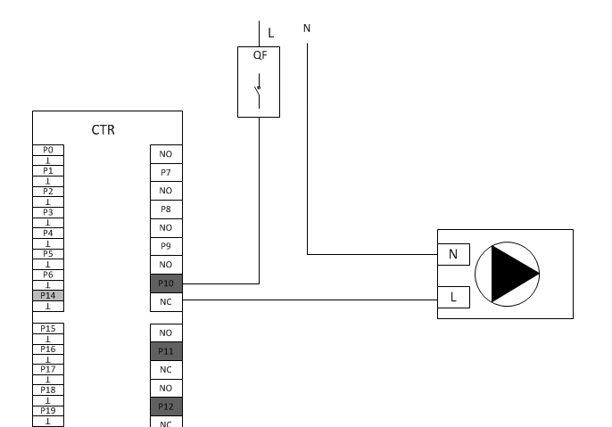

# Водоснабжение

* Датчик протечки монтируется на пол в местах потенциально возможной протечки.
  Подключается витой парой UTP 5e

* Клапан перекрытия воды  с сервоприводом на 220В. Подключение кабелем ШВВП или
  ПВС 3х075

## Подключение датчика протечки

К контроллеру TouchOn можно подключать любые датчики протечки. Датчики протечки
подключаются на любые стандартные входы: P0-P6, P15-P21

Характеристики датчика:

|                   |                  |
| ----------------- | ---------------- |
|  Электропитание   | -                |
|  Протокол         | Сухой контакт NO |
|  Способ монтажа   | Напольный        |

Датчик протечки Теко Астра-361:

Пример подключения датчика Теко Астра-361:

## Двухходовой клапан

Для обеспечения перекрытия подачи воды в случае аварии или протечки, необходимо
установить на трубы подвода воды электрические 2-х ходовые зональные клапаны.
Время открывания и закрывания клапана задается программно. Сервоприводы клапанов
подключаются к любому выходу контроллера на NO контакт. Соответственно для
перекрытия воды используется два клапана (холодная, горячая вода) и 4 выхода
контроллера.  

Используемые модели: 

* STOUT SVM-0070-200020 

* Neptun AquaControl 220В

* Или аналог. 

Пример подключения  Neptun AquaControl 220В:

## Насосы

Подключение насосов, которые играют важную роль в жизнедеятельности системы
отопления и водоснабжения и которые в основном  в работе (скважинные насосы,
циркуляционные насосы, компрессоры биостанций и др.), подключаются на
нормально-замкнутые контакты контроллера. Контакты NC есть на портах Р10-Р13 и
Р25-Р28. 

Насосы, которые в основном не в работе и включаются только по каким-то нуждам
или условиям (насос полива или циркуляционный насос отопления бани), лучше
подключать на нормально-открытые контакты портов.

Схема подключения:

